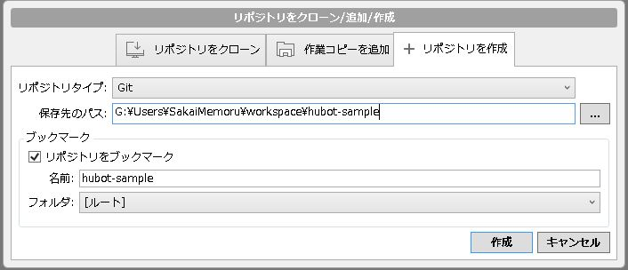
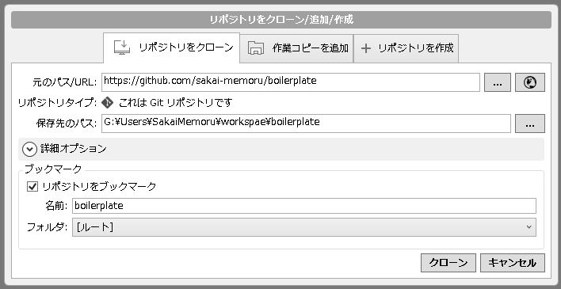

# SourceTree
[DevOps](../index.md) > [git](index.md)

## Overview
SourceTree

https://ja.atlassian.com/software/sourcetree

## Description

## Installation

## Usage

1. open target repository tab form bookmark.
2. shift+alt+T : open git bash terminal.
3. `$ atom . ` : execute command and edit project folder with atom.

### create repository
1. create repository . (ctrl+n > ctrl+tab*2)

### clone repository
1. clone repository . (ctrl+n)

### operation

|shortcut   |command          |
|-----------|-----------------|
|shft+alt+T |Terminal         |
|ctrl+1     |file status      |
|ctrl+2     |log              |
|ctrl+3     |Search log       |

## Configuration

- [ ] TODO Usage of SourceTree 

// --- end of file --- //
