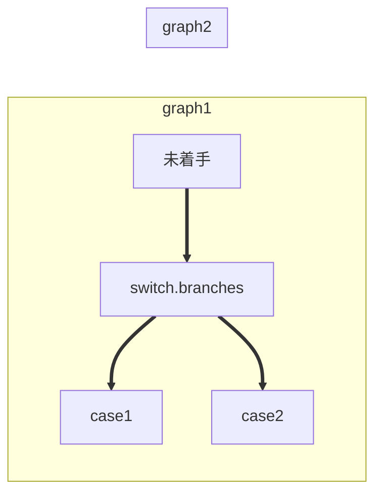

Haroopad
==========================

Overview
--------------------------

Haroopad is a markdown editor for creating web-friendly documents.
http://pad.haroopress.com/

* GitHub Flavored Markdown.
* VIM keyboard bind

Description
--------------------------

Download
--------------------------
Download site
https://bitbucket.org/rhiokim/haroopad-download/downloads/Haroopad-v0.13.1-win-x64.msi

Setting
--------------------------
* ファイル > 設定 > エディタ > あなたのスタイル > 編集
  Change Edtor font.
  C:\Users\sakai\AppData\Local\Haroopad\Themes\editor

```CSS
editor {
    font-family: 'Bitstream Vera Sans Mono', 'Courier New', Courier, 'MS Gothic', 'Osaka-Mono', 'TakaoGothic', 'Hiragino Kaku Gothic ProN', 'メイリオ', monospace !important;
}
```

* ファイル > 設定 > ビューワ > あなたのスタイル > 編集
  Change Edtor font.
  C:\Users\sakai\AppData\Local\Haroopad\Themes\viewer 

```CSS
>* {
  font-family: 'Helvetica Neue', Helvetica, 'Hiragino Kaku Gothic ProN', Meiryo, sans-serif;
}

code {
  font-family: 'Bitstream Vera Sans Mono', Courier, monospace;
  font-weight: normal;
}
```

Markdown writing
--------------------------
### Section tag
\# Header1
\## Header2
\### Header3

# Header1
## Header2
### Header3

### Style tag
\**Bold**
\*Emphasize*
\++Underline++
\~~Strikethrough~~
\==Highlight==

**Bold**
*Emphasize*
++Underline++
~~Strikethrough~~
==Highlight==

### List
\- Desc list
\1. Order list
\- [ ] Task list

- Desc list
1. Order list
- [ ] Task list

### Link
\ // image
\[link text](url) // link

### Code
code block
```javascript
const name = 'haroopad'
console.log(`Hello #{name}!`);
// => Hello haroopad!
```

`code word and sentence`

### Table Tag
```markdown
| Left align | Right align | Center align |
|:-----------|------------:|:------------:|
| This       |This         |This          |
| column     |column       |column        |
| will       |will         |will          |
| be         |be           |be            |
| left       |right        |center        |
| aligned    |aligned      |aligned       |
```

| Left align | Right align | Center align |
|:-----------|------------:|:------------:|
| This       |This         |This          |
| column     |column       |column        |
| will       |will         |will          |
| be         |be           |be            |
| left       |right        |center        |
| aligned    |aligned      |aligned       |

### Blockquotes Tag

```markdown
> quoting sentence
```
> quoting sentence

### mermaid (Flowchart)


Reference
--------------------------
MarkdownエディタHaroopadを使ってみた
http://d.hatena.ne.jp/yamap_55/20140928/1411920898

HarooPad for Markdown Editor
http://qiita.com/yoshi-naoyuki/items/fcfc19a76079ae2f99ea

// --- end of file --- //