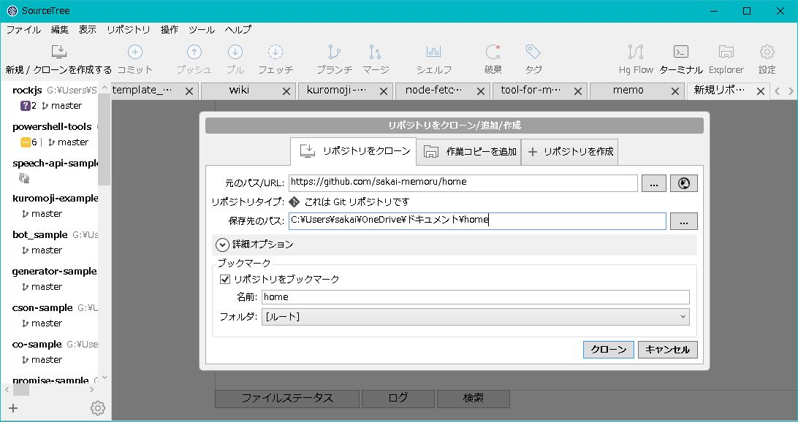
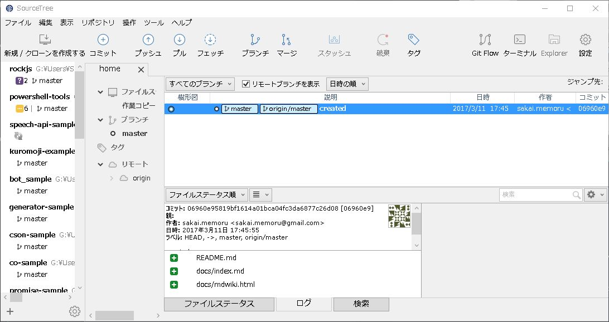
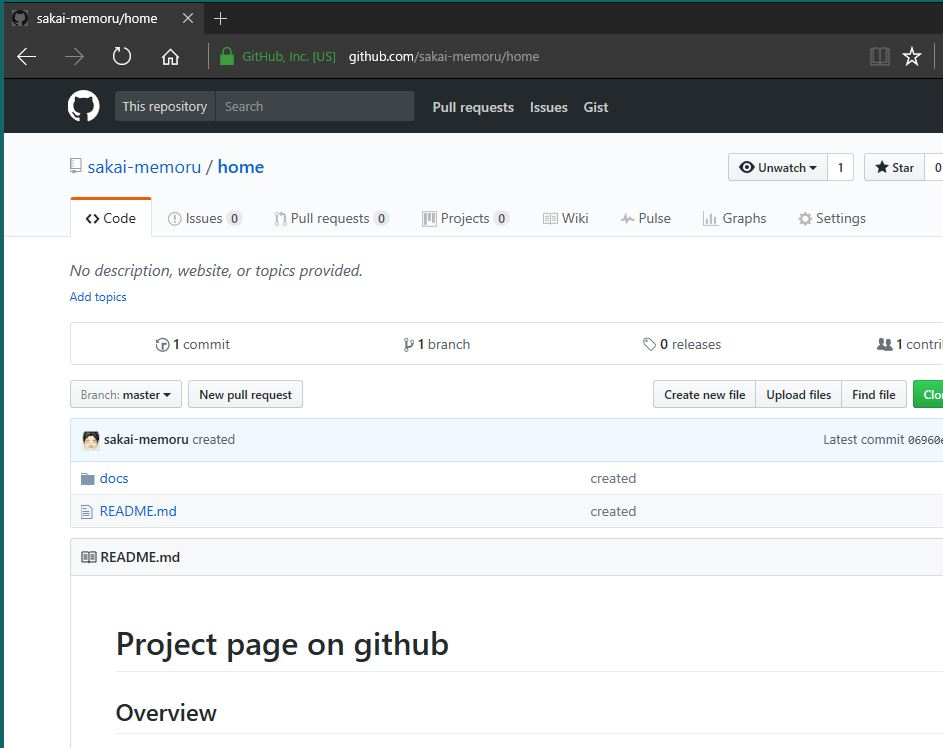

HOSTING DIRECTLY ON GITHUB
====

Overview
----------
You can publish on Github repository for your own web static sites.

http://**username**.github.io/**repos**/

Description
-----------
Do with the following procedure.

1. Create github repogitory  
`home`

2. Set local repository with cloning remote repository on github.

    * Clone into local repository from remote repositry with sourcetree.

     

2.Make files and directory.

  * Create file and directory.
      - README.md
      - docs/
      - docs/index.md
      - docs/navigation.md

docs/navigationmd (sample)
```markdown
# home
[About](about.md)
[Donwload](download.md)
[gimmick:themechooser](Choose theme)
[gimmick:theme(inverse:true)](flatly)
```

3.Copy `MDWiki.html` files and rename into `index.html`.
  * Download and Copy MDWiki apps. MDWiki is a light-weight page-generate tool. MDWiki support to publish markdown files on web pages.

      MDWiki (latest version 0.6.2 on 2014/05)  
      http://dynalon.github.io/mdwiki/#!index.md

      note: Rename mdwiki.html to index.html and copy to docs directory.Then create index.md in docs directory.

4. Push local changes to remote github.
  * Push by sourcetree.
     

  * After uploading.
    

5. Set Github page on Setting page.

  * Set Source target on master/docs folder.
    


> Github Pages is designed to host your personal, organization, or project pages from a GitHub repository.  
> *Source*  
> Github Pages is currently disavled. You must first add contents to your repoository vefore you can publish a GitHub pages site.

6. Access to project page.
  url is below.  
  https://sakai-memoru.github.io/home/  
  It's redirect to  `/home/index.html#!index.md`

    https://**username**.github.io/**repos**/

// --- end of file --- //
