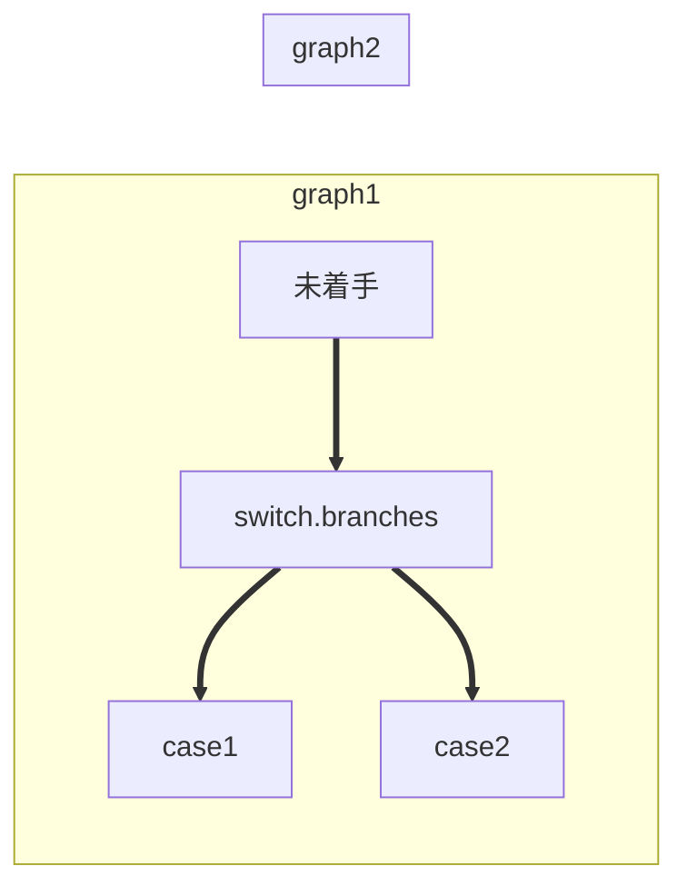

MDWiki > Markdown
==========================
[DevOps](../index.md) > [mdwiki](index.md)

Overview
--------------------------

Description
--------------------------

Markdown writing
--------------------------
### Section tag
\# Header1
\## Header2
\### Header3

# Header1
## Header2
### Header3

### Style tag
\**Bold**
\*Emphasize*
\++Underline++
\~~Strikethrough~~
\==Highlight==

**Bold**
*Emphasize*
++Underline++
~~Strikethrough~~
==Highlight==

### List
\- Desc list
\1. Order list
\- [ ] Task list

- Desc list
1. Order list
- [ ] Task list

### Link
\ // image
\[link text](url) // link

### Code
code block
```javascript
const name = 'haroopad'
console.log(`Hello #{name}!`);
// => Hello haroopad!
```

`code word and sentence`

### Table Tag
```markdown
| Left align | Right align | Center align |
|:-----------|------------:|:------------:|
| This       |This         |This          |
| column     |column       |column        |
| will       |will         |will          |
| be         |be           |be            |
| left       |right        |center        |
| aligned    |aligned      |aligned       |
```

| Left align | Right align | Center align |
|:-----------|------------:|:------------:|
| This       |This         |This          |
| column     |column       |column        |
| will       |will         |will          |
| be         |be           |be            |
| left       |right        |center        |
| aligned    |aligned      |aligned       |

### Blockquotes Tag

```markdown
> quoting sentence
```
> quoting sentence

### mermaid (Flowchart)


Reference
--------------------------

// --- end of file --- //
